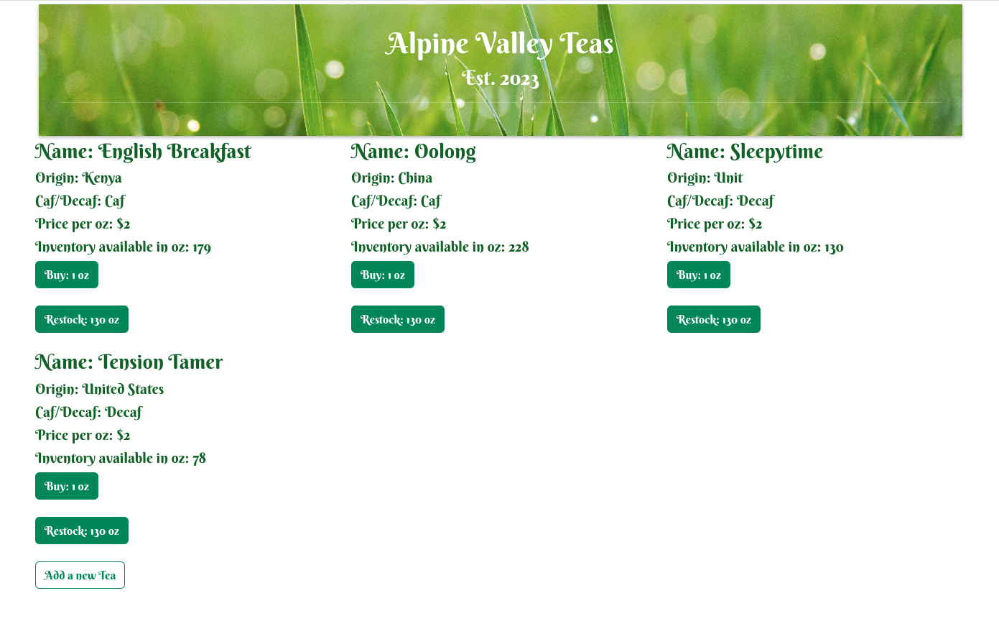
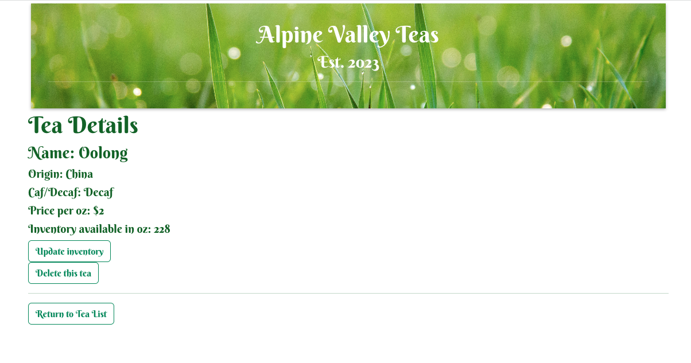
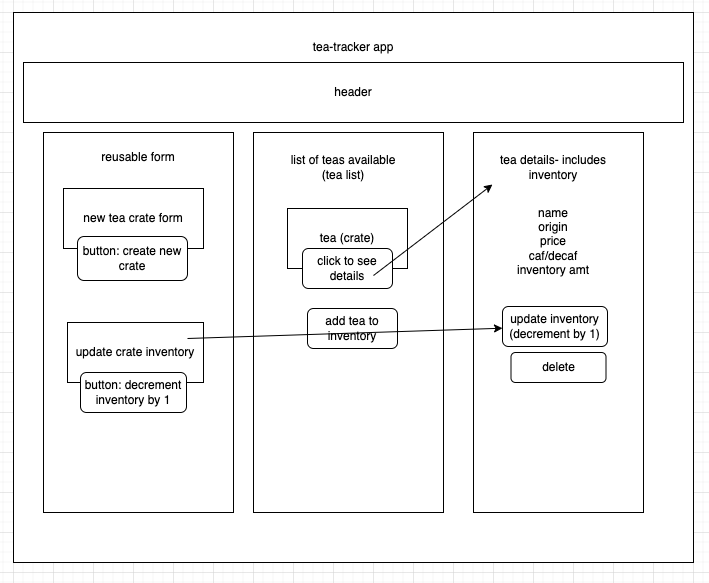

# Tea Tracker

### An app to help a tea shop track its inventory.

#### By: Sarah Andyshak

#### 🫖 [Technologies Used](#technologies-used)
#### ☕ [Component Diagram](#component-diagram)
#### 🧋 [Setup / Installation](#setup-and-installation)
#### 🍵 [Known Bugs](#known-bugs)
#### 🫖 [License](#license) 

## Technologies Used
* React
* JavaScript / JSX
* HTML / CSS
* Babel
* Bootstrap

## Mockup



## Component Diagram


```
App.js
├── Header.js
├── TeaControl.js
│   ├── NewTeaForm.js
│   │   ├── ReusableForm.js
│   ├── TeaList.js   
│   │   ├── Tea.js
│   ├── TeaDetail.js   
│   ├── EditTeaForm.js            
```

# Getting Started with Create React App

This project was bootstrapped with [Create React App](https://github.com/facebook/create-react-app).

## Setup and Installation

Clone this project to your local machine by using the following command:
```
git clone https://github.com/SarahAndyshak/tea-tracker.git
```

**Directions after cloning are as follows:**
1. Open the `tea-tracker` directory within your CLI.
2. Install all Node packages and dependencies with the command `npm install`.
3. Package and open the project in your browser using `npm run start`.
4. Enjoy!

## Known Bugs

* As of 24 April 2023, bugs should be fixed. 

## License

**MIT License**

Copyright (c) 2023 Sarah Andyshak

Permission is hereby granted, free of charge, to any person obtaining a copy
of this software and associated documentation files (the "Software"), to deal
in the Software without restriction, including without limitation the rights
to use, copy, modify, merge, publish, distribute, sublicense, and/or sell
copies of the Software, and to permit persons to whom the Software is
furnished to do so, subject to the following conditions:

The above copyright notice and this permission notice shall be included in all
copies or substantial portions of the Software.

THE SOFTWARE IS PROVIDED "AS IS", WITHOUT WARRANTY OF ANY KIND, EXPRESS OR
IMPLIED, INCLUDING BUT NOT LIMITED TO THE WARRANTIES OF MERCHANTABILITY,
FITNESS FOR A PARTICULAR PURPOSE AND NONINFRINGEMENT. IN NO EVENT SHALL THE
AUTHORS OR COPYRIGHT HOLDERS BE LIABLE FOR ANY CLAIM, DAMAGES OR OTHER
LIABILITY, WHETHER IN AN ACTION OF CONTRACT, TORT OR OTHERWISE, ARISING FROM,
OUT OF OR IN CONNECTION WITH THE SOFTWARE OR THE USE OR OTHER DEALINGS IN THE
SOFTWARE.